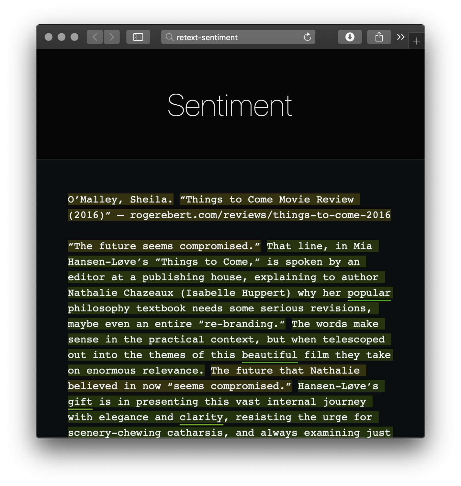

# retext-sentiment

## Related

*   [retext-pos](https://github.com/retextjs/retext-pos)
*   [readability](https://github.com/wooorm/readability)
*   [write-music](https://github.com/wooorm/write-music)
*   [common-words](https://github.com/wooorm/common-words)
*   [short-words](https://github.com/wooorm/short-words)
